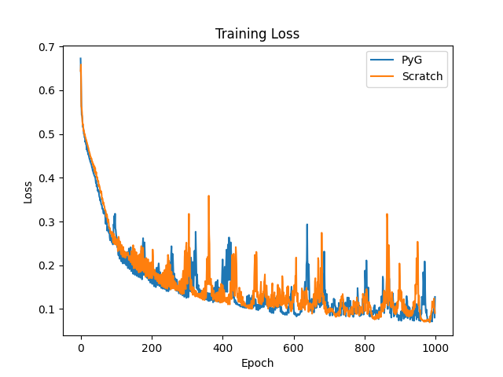
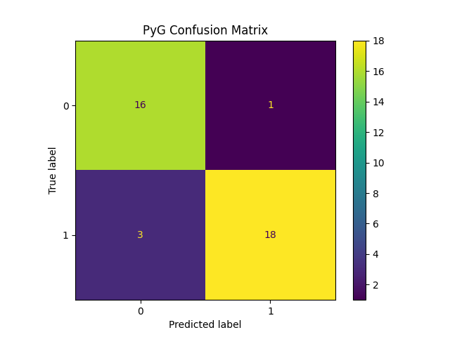
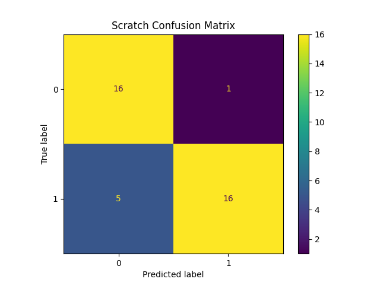

# PyG vs From-Scratch MPNN 비교

## 주제:

PyTorch Geometric(PyG)의 `MessagePassing` 기반 MPNN 구현을 순수 PyTorch(from scratch) 로 복제했을 때, 학습 동작이 실제로 정확히 동일하게 재현되는가를 실험적으로 검증한다.

---

## 동기:

PyG는 GNN 구조를 매우 간단하게 만들 수 있는 라이브러리지만, 내부에서 어떤 연산들이 일어나는지를 추상화하고 있기 때문에 직접 구현을 해보지 않으면 메시지 전달(Message Passing), aggregation, update 등 GNN의 핵심 개념을 완전히 이해하기 어렵다.

그래서:

* PyG의 `MessagePassing` 클래스를 직접 모방해
* 동일한 구조, 동일한 연산 흐름으로 scratch 버전 구현
* 결과가 정말로 같아지는지 확인하고,
* 다르다면 왜 다른지를 분석하고자 했다.

---

## 실험 방법:

### 1. 모델 구조

PyG 기반 모델과 Scratch 모델 모두 2-layer MPNN으로 구성.

* 입력: `x`, `edge_index`, `edge_attr`
* 각 레이어:

  ```math
  m_{ij} = W_x \cdot x_j + W_e \cdot e_{ij}
  ```

  ```math
  h_i = \text{ReLU} \left( \sum_{j \in \mathcal{N}(i)} m_{ij} \right)
  ```
* 마지막은 global mean pooling 후 classifier layer 적용:

  ```math
  \hat{y}_G = \text{Linear} \left( \frac{1}{|V_G|} \sum_{i \in G} h_i \right)
  ```

### 2. 구현 원칙

* `message()`, `aggregate()`, `update()` 구조를 PyG 스타일 그대로 나눠 구현
* `update()`는 PyG의 방식에 따라 x\_i를 사용하지 않고, 오직 aggregation된 메시지만 사용
* `edge_attr`는 `edge_mlp`로 임베딩 후 message에 더함
* 파라미터 초기화는 `reset_parameters()`를 모두 명시적으로 호출

### 3. 데이터셋

* PyG 내장 `MUTAG` 그래프 분류 데이터셋
* 노드 feature: 7차원
* 엣지 feature: 4차원 (one-hot)

### 4. 실험 환경

* optimizer: Adam
* lr: 0.01
* epoch: 1000
* seed 고정 (`torch`, `random`, `numpy`)
* PyG 모델과 Scratch 모델 동시에 학습 및 비교

---

## 결과

### Training Curve 비교:



* 학습 초기: PyG와 Scratch 모두 유사한 감소 곡선을 보임
* 중후반: 일부 노이즈(spike)는 존재하지만 전체적으로 거의 동일한 동작
* 성능이 중요한 실험이 아니지만, 정확도와 예측 분포도 유사

### Confusion Matrix 비교:


#### PyG 모델 결과




* 총 정확도: $(16 + 18) / (16 + 1 + 3 + 18) = 34 / 38 \approx 89.5\%$

---

#### Scratch 모델 결과



* 총 정확도: $(16 + 16) / (16 + 1 + 5 + 16) = 32 / 38 \approx 84.2\%$

---

#### 해석

* 클래스 0에 대한 예측 성능은 두 모델 모두 거의 동일 (16/17)
* \*\*클래스 1 (positive class)\*\*에 대해 PyG는 18개 맞췄고 Scratch는 16개 맞춤
* Scratch는 약간 더 보수적으로 예측하는 경향을 보이며, 클래스 1을 클래스 0으로 더 많이 잘못 분류함 (False Negative ↑)

>  initialization 차이, 혹은 PyTorch scatter 연산의 precision 차이에서 미세하게 발생할 수 있음

---

#### 결론

* Scratch 모델은 구조적으로 PyG를 거의 완벽히 모방했지만, 미세한 예측 차이는 존재함
* 특히 decision boundary 경계에 가까운 샘플들에 대한 처리에서 PyG 쪽이 더 일관적이었음
* 하지만 전반적인 분류 성능, 클래스 분포, 혼동 행렬 패턴은 상당히 유사하므로 목표는 충분히 달성됨

---

## 분석 및 인사이트

### 무엇이 동일하게 작동했는가?

* `message()`에서 `x_j + edge_embedding` 구조
* `aggregate()`에서 `scatter_add()`로 sum 집계
* `update()`는 PyG처럼 `x_i`를 사용하지 않고 단순 ReLU
* global\_mean\_pool 직접 구현 vs PyG의 `global_mean_pool` → 결과 동일

### 주의 깊게 확인했던 부분

* `x_i`를 update에 넣으면 PyG와 다른 결과가 나왔음 (이게 많은 혼동을 줌)
* `reset_parameters()` 누락 시 학습 패턴이 불안정했음
* edge\_attr가 `None`일 때 PyG는 자동으로 생략하지만, scratch에서는 명시적인 처리가 필요

---

## 개선할 점

### 1. 초기화 방식 상세 분석

* `torch.nn.Linear` 초기화는 기본 Xavier Uniform인데, PyG 내부에서는 레이어별로 `reset_parameters()`를 명시적으로 불러 주는 경우가 많음
* scratch 모델도 동일한 초기화를 명시적으로 해야 더 정밀한 비교 가능

### 2. 학습률, 스케줄러, 배치 크기 변화 실험

* 현재는 고정 learning rate (0.01), 다양한 lr/opt 조합에 따라 divergence 여부 확인 필요

### 3. `dropout`, `layernorm` 등 구성 실험

* 둘 다 미적용 상태지만, 적용 후에도 구조적 일치를 유지하는지 확인할 수 있음
